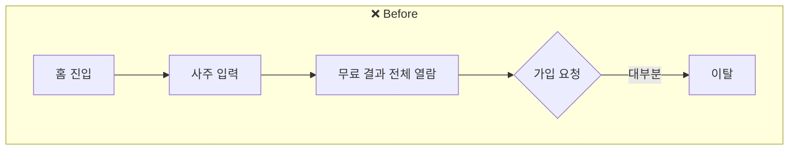
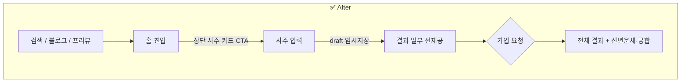
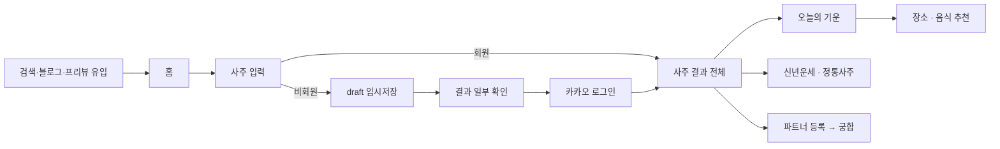
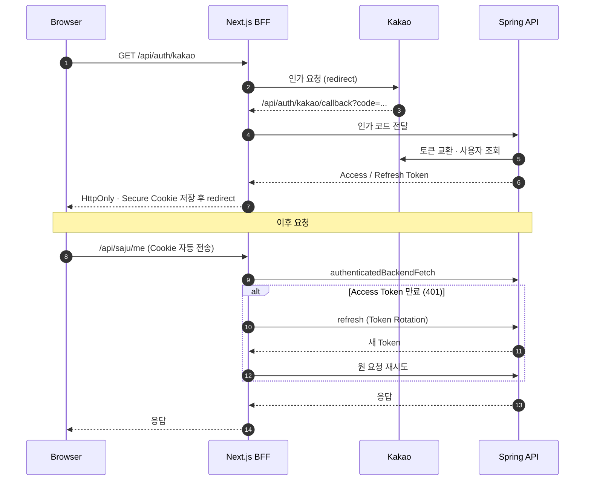
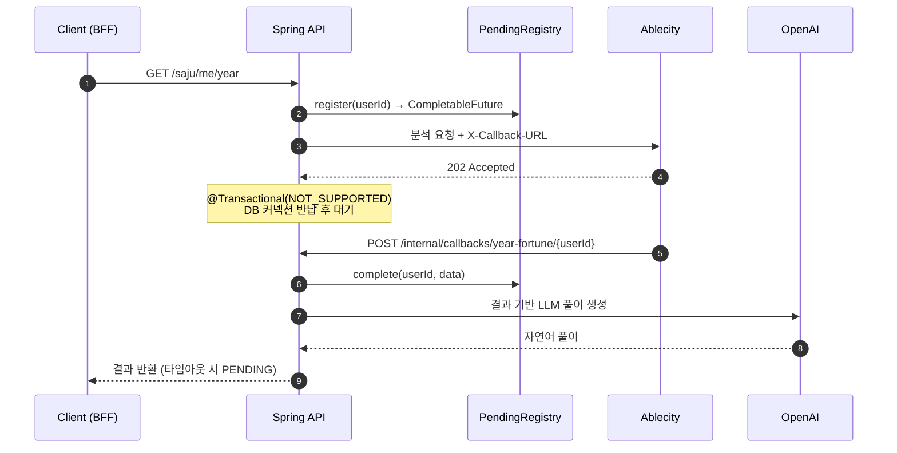
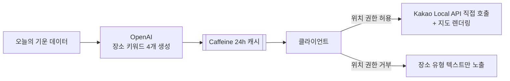
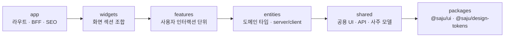
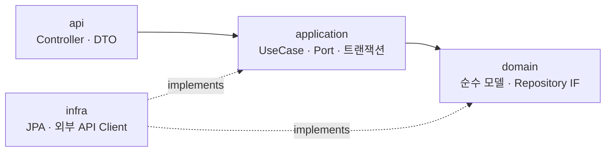
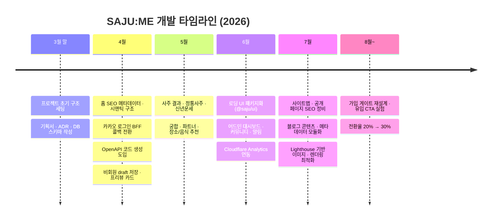

<div align="center">

# 🔮 SAJU:ME

**생년월일시 하나로 사주·운세·궁합을 풀어주는 웹 서비스**

사주 분석 → 오늘의 기운 → 맞춤 추천(장소·음식) → 궁합까지 한 흐름으로 제공합니다.

[서비스 바로가기](https://saju-me.com) · [기술 문서](./Frontend/apps/docs) · [기획서](./Docs/sajume_기획서_v1.0.pdf) · [기술 설계서(ADR)](./Docs/sajume_ADR(기술%20설계서)_v1.0.pdf)


<br/>


</div>

---

## 📑 목차

1. [프로젝트 소개](#-프로젝트-소개)
2. [주요 기능](#-주요-기능)
3. [그로스 & SEO — 유입·가입 전환 실험](#-그로스--seo--유입가입-전환-실험)
4. [전체 시스템 구조](#-전체-시스템-구조)
5. [아키텍처 다이어그램](#-아키텍처-다이어그램)
6. [동작 프로세스](#-동작-프로세스)
7. [레이어 구조](#-레이어-구조)
8. [프로젝트 구조](#-프로젝트-구조)
9. [핵심 기술 결정](#-핵심-기술-결정)
10. [품질 관리 & CI](#-품질-관리--ci)
11. [개발 과정](#-개발-과정)
12. [팀](#-팀)

---

## 🌙 프로젝트 소개

| 항목 | 내용 |
|------|------|
| **서비스** | 생년월일시 기반 사주·운세·궁합 콘텐츠 웹앱 |
| **기간** | 2026.03.31 ~ 진행 중 |
| **팀 구성** | 기획 1 · FE 1 · BE 1 |
| **규모** | 커밋 730+ · 머지된 PR 310+ |
| **핵심 키워드** | BFF · FSD 레이어 · SSR/SSG 분리 · 비동기 콜백 · LLM 연동 · 퍼널 계측 · SEO(JSON-LD) |

### 해결하려는 문제

- 사주 서비스는 **결과가 어렵고 딱딱해서** 한 번 보고 끝나는 경우가 많습니다.
- 무료 결과만 보고 **가입 없이 이탈하는 비회원 비중이 높았습니다.**

### 우리의 접근

- 사주 8자·오행 데이터를 **LLM으로 자연어 풀이**해 읽기 쉬운 콘텐츠로 전환
- "오늘의 기운"을 **장소·음식 추천**으로 연결해 매일 다시 올 이유 제공
- **결과 일부를 먼저 보여준 뒤 가입을 요청**하는 흐름으로 전환율 개선

---

## ✨ 주요 기능

| 기능 | 설명 | 경로 |
|------|------|------|
| 🧾 **사주 입력** | 생년월일·출생시간·성별 입력, 미로그인 상태도 임시저장(draft) 후 이어하기 | `/saju` |
| 🔮 **사주 결과** | 사주팔자·오행 분포·일간 성향을 카드형 UI로 제공 | `/saju/result` |
| 📜 **정통 사주 풀이** | 천간·지지 기반 전통 해석 + LLM 풀이 | `/api/saju/traditional` |
| 🗓️ **신년운세** | 연간 흐름을 월별로 풀이 (비동기 분석) | `/api/saju/me/year` |
| 🧠 **성향 분석** | 사주 기반 성격·기질 분석 | `/api/saju/me/personality` |
| 💞 **궁합** | 파트너 등록 후 두 사람의 사주 궁합 상세 분석 | `/compatibility` |
| 🐉 **띠별 궁합** | 12지신 기반 간단 궁합 점수 | `/api/saju/zodiac-compatibility` |
| 📍 **장소 추천** | 오늘의 기운 → LLM 키워드 생성 → 카카오맵 장소 검색 | `/api/location` |
| 🍚 **음식 추천** | 오행 기운에 맞는 음식 추천 | `/food` |
| 👀 **프리뷰 페이지** | 비회원용 신년운세·정통사주·궁합 미리보기 (SSG) | `/preview/*` |
| 📰 **블로그** | 사주 입문·12지신 운세 등 검색 유입용 콘텐츠 20+편 | `/blog` |
| 💬 **커뮤니티 / 알림 / 문의** | 게시판, 알림 센터, 1:1 문의 | `/community` |
| 🔐 **카카오 로그인 / 탈퇴 복구** | BFF 콜백 기반 OAuth, 30일 유예 후 익명화 | `/login` |
| 🛠️ **어드민** | 트래픽 대시보드, 모니터링, 커뮤니티·알림·결제 관리 | `apps/admin` |

---

## 📈 그로스 & SEO — 유입·가입 전환 실험

> **"콘텐츠는 보는데 가입은 안 한다"** 는 문제를 계측으로 확인하고, 가입 흐름과 유입 경로를 다시 설계했습니다.

### 문제 → 분석

| 단계 | 내용 |
|------|------|
| **문제** | 무료 콘텐츠 열람 후 이탈하는 비회원 비중이 높아 가입 전환율이 정체 |
| **분석** | 퍼널 계측 결과 **무료 결과 열람 직후 이탈이 집중**되고, 가입 요청 접점이 **열람 이후 한 곳에만** 존재함을 확인 |

### 실행





| # | 작업 | 내용 |
|---|------|------|
| 1 | **가입 시점 변경** | 결과를 전부 보여준 뒤 가입을 요청하던 방식 → **결과 일부를 먼저 보여주고 가입을 요청**하도록 전환. 미로그인 입력은 `/api/saju/draft`로 임시저장해 가입 후 그대로 이어서 확인 |
| 2 | **유입 접점 확대** | 첫 화면 상단에 **사주 카드 CTA**를 추가해 *인지 단계*와 *전환 단계*를 분리. 기존 하단 CTA와 함께 진입 경로를 이중화 |
| 3 | **전환 계측** | 퍼널 이벤트 기반 자체 계측과 **어드민 대시보드**(Cloudflare Analytics 연동)를 구축해 실험 결과를 직접 확인 |
| 4 | **검색 노출** | 사용자별 **동적 사주 결과는 SSR**, 블로그·프리뷰 같은 **정적 콘텐츠는 SSG**로 분리해 크롤러가 완성된 HTML을 수집하도록 구성 |
| 5 | **구조화 데이터** | Next.js `metadata` API로 title/description/canonical/OG를 페이지별로 관리하고, **JSON-LD**(`WebSite` · `WebPage` · `Organization` · `Article`) 적용 |

### 성과

| 지표 | 결과 |
|------|------|
| 🎯 **유입 대비 가입 전환율** | **20% → 30%** (+10%p) |
| 👆 **상단 유입 지표** (첫 화면 사주 카드 클릭 등) | **약 15% 상승** |
| 🔁 **기존 하단 CTA 유입** | 진입 CTA 추가 후 **동반 증가** |

### SEO 적용 상세

| 영역 | 적용 내용 | 파일 |
|------|-----------|------|
| 공통 메타 | `metadataBase`, title 템플릿, `robots`, Open Graph, Twitter 카드 | `app/layout.tsx` |
| 페이지 메타 | 페이지별 title/description/canonical 분리, 블로그 메타는 데이터 모듈로 분리 | `app/**/page.tsx`, `blog/_data/articles.ts` |
| 사이트맵 | 정적 페이지 + 블로그 글 자동 등록, `lastModified`는 **실제 콘텐츠 수정일** 기준 (빌드 시각 X) | `app/sitemap.ts` |
| robots | `/mypage/`, `/api/` 크롤링 제외 | `app/robots.ts` |
| 시맨틱 HTML | `main` · `section` · `h1` · `nav` 구조화, 장식 요소 `aria-hidden` | `widgets/**` |
| 링크 텍스트 | "시작하기" → **"무료 사주 보기"**, **"무료 궁합 확인"** 처럼 목적이 드러나는 CTA | `widgets/**` |
| 성능 | 모바일 전용 이미지 교체, WebP 전환, `next/image` 경로 정리, 미사용 CSS/JS 제거 (Lighthouse 기반) | `#572`, `#579` |

---

## 🏗️ 전체 시스템 구조

| 구성 요소 | 기술 | 역할 |
|-----------|------|------|
| **Web** | Next.js 16 (App Router) on Cloudflare Workers | SSR/SSG 페이지 렌더링 + BFF API Route |
| **Admin** | Next.js on Cloudflare Workers | 운영 대시보드·모니터링·관리 |
| **Docs** | Docusaurus | 아키텍처·기능·ADR·API 문서 |
| **API Server** | Spring Boot 3.5 · Java 17 | 사주 계산, 운세·궁합 분석, 인증, 커뮤니티 |
| **Database** | MySQL 8.0 · Flyway | 영구 저장, 스키마 마이그레이션 |
| **Cache** | Caffeine (인프로세스) | 장소 키워드 24h TTL 캐시 (스케일아웃 시 Redis 전환 계획) |
| **Storage** | AWS S3 | 파일 저장 |
| **External** | Ablecity API · OpenAI(gpt-4o-mini) · Kakao Login/Map · Cloudflare Turnstile · AdSense | 사주 계산 · LLM 풀이 · 인증/지도 · 봇 방지 · 광고 |

---

## 🗺️ 아키텍처 다이어그램

```mermaid
flowchart TB
    User([👤 사용자 브라우저])
    Crawler([🤖 검색 크롤러])

    subgraph CF["☁️ Cloudflare"]
        direction TB
        subgraph WEB["saju-me.com · Next.js Worker"]
            Pages["Pages<br/>SSR: 사주 결과 · 마이페이지<br/>SSG: 블로그 · 프리뷰"]
            BFF["BFF API Routes<br/>app/api/**/route.ts<br/>HttpOnly Cookie · CSRF · Turnstile"]
        end
        ADMIN["admin · Next.js Worker"]
        CFA[(Cloudflare Analytics)]
    end

    subgraph AWS["🟧 AWS"]
        NGINX["Nginx<br/>api.saju-me.com · HTTPS 종단"]
        subgraph SPRING["Spring Boot API Server"]
            direction LR
            AUTH[auth / user]
            SAJU[saju / partner]
            REC[place / food]
            COMM[community / notification / inquiry]
            ADM[admin]
        end
        DB[(MySQL 8.0)]
        CACHE[[Caffeine Cache]]
        S3[(S3)]
    end

    subgraph EXT["🔌 External APIs"]
        ABLE[Ablecity<br/>사주 8자 · 운세 분석]
        OPENAI[OpenAI<br/>gpt-4o-mini]
        KAKAO[Kakao<br/>OAuth · Local API]
    end

    User --> Pages
    Crawler --> Pages
    Pages --> BFF
    BFF -->|REST| NGINX
    ADMIN -->|REST| NGINX
    ADMIN --> CFA
    NGINX --> SPRING
    SPRING --> DB
    SPRING --> CACHE
    SPRING --> S3
    SAJU -->|요청 202 / 결과 콜백| ABLE
    SAJU --> OPENAI
    REC --> OPENAI
    AUTH --> KAKAO
    User -.->|지도 SDK · 장소 검색<br/>GPS 좌표 서버 미전송| KAKAO
```



---

## 🔄 동작 프로세스

### 1. 사용자 여정



### 2. 인증 흐름 (BFF + HttpOnly Cookie)



### 3. 신년운세·궁합 비동기 콜백 (반동기 처리)

외부 사주 분석은 수 초~수십 초가 걸려 동기 호출 시 **클라이언트 타임아웃**과 **DB 커넥션 고갈**이 발생합니다.
`202 Accepted + 콜백` 방식을 받아들이되, 클라이언트에는 한 번에 결과를 돌려주는 **반동기(semi-sync)** 구조로 구현했습니다.



### 4. 장소 추천



> 🔒 **GPS 좌표는 서버로 전송하지 않습니다.** 위치 기반 검색은 클라이언트에서 Kakao API를 직접 호출합니다.

---

## 🧱 레이어 구조

### Frontend — FSD 기반 단방향 의존



| 레이어 | 책임 | 규칙 |
|--------|------|------|
| `app/` | 라우트 엔트리, BFF(`api/**/route.ts`), 메타데이터 | 비즈니스 로직 금지, 위젯 조립만 |
| `widgets/` | 여러 feature를 묶은 화면 섹션 | — |
| `features/` | `hooks` · `model` · `type` · `ui` 로 구성된 기능 단위 | `useQuery`/`useMutation`은 **feature hooks에서만** |
| `entities/` | 도메인 타입, `server/`·`client/` 분리 | — |
| `shared/` | 공용 fetch 래퍼, 오행·간지·만세력 모델, 공용 UI | 상위 레이어 import 금지 |

### Backend — DDD 기반 도메인 우선 패키지



| 레이어 | 책임 | 하면 안 되는 것 |
|--------|------|-----------------|
| `api/` | 요청 수신, DTO 변환, 응답 | 비즈니스 로직 |
| `application/` | 트랜잭션 경계, UseCase 조합 | 인프라 직접 호출 |
| `domain/` | 순수 비즈니스 규칙 (POJO, `record` VO, `Enum`) | DB·외부 API 접근 |
| `infra/` | JPA 구현체, Ablecity·OpenAI 클라이언트 | 비즈니스 판단 |

---

## 📂 프로젝트 구조

```
saju/
├── Frontend/                      # npm workspaces 모노레포
│   ├── apps/
│   │   ├── web/                   # 사용자 서비스 (Next.js)
│   │   │   ├── src/
│   │   │   │   ├── app/           # (main) (auth) (error) 라우트 · api/ BFF · sitemap · robots
│   │   │   │   ├── widgets/
│   │   │   │   ├── features/      # saju-input · saju-result · compatibility · preview · payment ...
│   │   │   │   ├── domain/        # navigation · saju 전용 UI
│   │   │   │   ├── entities/      # auth · saju · user · compatibility · community ...
│   │   │   │   ├── shared/
│   │   │   │   └── generated/     # OpenAPI 스펙 기반 자동 생성 API 클라이언트
│   │   │   └── e2e/               # Playwright
│   │   ├── admin/                 # 어드민 (dashboard · monitoring · community · payment)
│   │   └── docs/                  # Docusaurus 기술 문서 · ADR · 기획서
│   └── packages/
│       ├── ui/                    # @saju/ui — 무상태 UI primitive
│       └── design-tokens/         # @saju/design-tokens — CSS 변수 · 테마
│
├── Docs/                          # 기획서 · ADR · 페이지 설계 · SEO 문서
└── .github/workflows/             # FE 배포 · E2E · Chromatic
```

> ℹ️ 이 저장소는 포트폴리오용으로 **프론트엔드 소스만 공개**합니다. 백엔드(Spring Boot) 소스는 포함되어 있지 않으며, 백엔드 구조는 위 아키텍처·레이어 구조 섹션에서 설명합니다.

---

## 🧭 핵심 기술 결정

| 결정 | 이유 |
|------|------|
| **BFF 패턴** | 백엔드 주소·토큰이 브라우저에 노출되지 않도록 모든 통신을 `route.ts`로 경유. 토큰 갱신·CSRF·Turnstile 검증을 `withApiGuards` 한 곳에서 처리 |
| **HttpOnly Cookie 인증** | XSS로부터 토큰 보호, Refresh Token Rotation 적용 |
| **SSR / SSG 분리** | 개인화 결과는 SSR, 블로그·프리뷰는 SSG로 검색 노출과 성능을 동시에 확보 |
| **OpenAPI 기반 코드 생성** | 백엔드 스펙 → `@hey-api/openapi-ts`로 타입·클라이언트 자동 생성, 스펙 변경 시 워크플로우로 동기화 |
| **반동기 콜백 처리** | 외부 분석 API의 긴 응답 시간 동안 DB 커넥션을 점유하지 않도록 `CompletableFuture` 기반 대기 |
| **LLM + 폴백** | gpt-4o-mini로 비용을 낮추고, API 장애 시 기본 풀이 텍스트로 대체 |
| **모듈러 모놀리스** | MVP 단계에서 운영 복잡도를 낮추고, 도메인 경계는 패키지로 유지해 분리 가능성 확보 |
| **Caffeine → Redis 전환 계획** | 단일 인스턴스에서는 인프로세스 캐시, 스케일아웃 시 캐시·RT·PendingRegistry를 Redis로 이관 |

---

## ✅ 품질 관리 & CI

| 영역 | 도구 |
|------|------|
| 단위 테스트 | Vitest (FE) · JUnit (BE) |
| E2E 테스트 | Playwright |
| UI 컴포넌트 | Storybook · Chromatic 시각 회귀 테스트 |
| 타입 안정성 | TypeScript · Zod · OpenAPI 생성 타입 |
| 코드 스타일 | ESLint · Prettier |
| 버전 관리 | Changesets |
| 성능 | Lighthouse 측정 기반 이미지·JS·CSS 최적화 |

**GitHub Actions 워크플로우**

`frontend-deploy` · `admin-deploy` · `docs-deploy` · `frontend-e2e` · `chromatic`

---

## 🛤️ 개발 과정



### 협업 방식

- **이슈 → 브랜치 → PR** : `feat/#번호`, `refactor/#번호`, `chore/#번호` 브랜치 전략, 이슈/PR 템플릿 사용
- **커밋 컨벤션** : `YYYY-MM-DD FE|BE type: 내용`
- **문서화** : 설계 결정은 ADR, 기능·아키텍처는 Docusaurus로 관리
- **AI 활용** : Claude Code 기반 스킬·에이전트 하네스로 코드 리뷰·디자인 시스템·문서화 자동화

---

## 👥 팀

| 역할 | 담당 |
|------|------|
| 기획 | 서비스 기획 · 페이지 설계 |
| Frontend | 박경찬 — 프론트엔드 전반 설계·구현, 그로스 실험·계측, SEO |
| Backend | API 서버 · 외부 API 연동 · DB 설계 |

